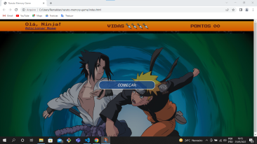
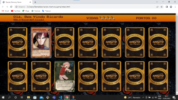
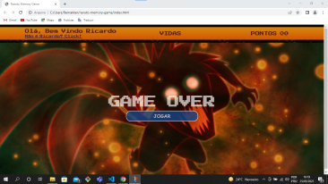
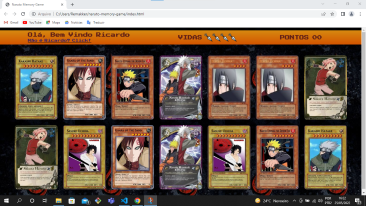
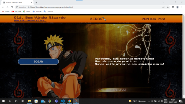

## naruto-memory-game

## Sobre o projeto

### Click no link abaixo para Jogar

https://snazzy-bunny-350545.netlify.app/

Naruto Game Card é uma aplicação front end web, destinada pros Naruteiros, para quem curti animes e gosta de exercitar a memoria!
Sou estudante de desenvolvimento Full stack, estou graduando em Análise e Desenvolvimento de Sistemas. Construir esse jogo também para praticar minhas habilidades de desenvolvimento front end com Javascript, estilização e efeitos 3d utilizando css, adicionando e salvando nome do usuario no localstorage para posteriormente utilizá-lo

A aplicação consiste em um jogo de memoria, onde o usuario tem cinco segundos para decorar a posição dos pares iguais de cartas viradas, depois desse periodo as cartas viram pro lado verso dando quatro possibilidades de erro "vidas" , cada acerto de pares gera cem pontos, se acertar todos os pares sem utilizar todas as vidas ganha o jogo apresenta layout, se errar pares perde uma vida, apos quatro erros game over, apresenta layout 

## Layout web
 

 

# Tecnologias utilizadas
- HTML 
- CSS
- JAVASCRIPT

# Como executar o projeto

## Front end web
Pré-requisitos:

## clonar repositório
No prompt de comando bash
git clone "Codigo copiado"

## entrar na pasta do projeto 
cd "Nome da pasta"

## Autor
Ricardo Araujo dos Santos
www.linkedin.com/in/ricardoaraujosantos3713
